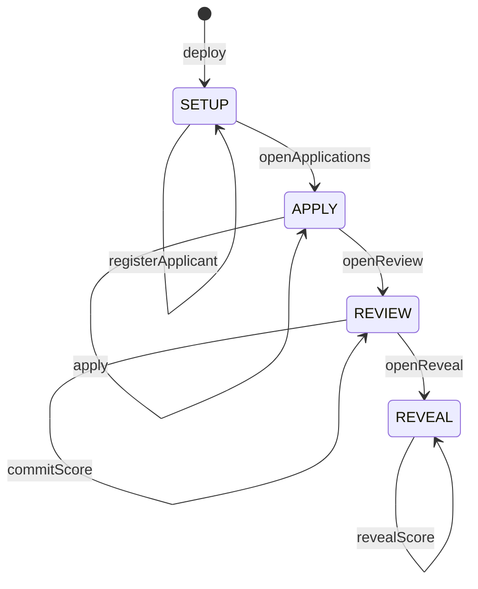

# AEQUIRA

[](https://github.com/sayweer/Aequira/actions/workflows/ci.yml)

**Sealed-ballot review on Midnight Network.** Reviewers score anonymous applications
through a commit–reveal flow: the score is proven valid while it is still hidden,
and the tally is publicly verifiable once it is opened.

|                      |                                                                                                                                    |
| -------------------- | ---------------------------------------------------------------------------------------------------------------------------------- |
| **Live demo**        | `TODO_DEMO_URL`                                                                                                                    |
| **Demo video**       | `TODO_DEMO_VIDEO_URL`                                                                                                              |
| **Preprod contract** | `3f390d6c373fcc40223dd0539e1ae1b73de7904ad55adf7db7e0de83823ad7c2`                                                                 |
| **Network**          | Midnight Preprod                                                                                                                   |
| **Circuits**         | 8 (`registerReviewer`, `registerApplicant`, `openApplications`, `apply`, `openReview`, `openReveal`, `commitScore`, `revealScore`) |
| **Tests**            | 166 (`pnpm test`)                                                                                                                  |

Short on time? [Verify this in five minutes](#verify-this-in-five-minutes) needs no
wallet, no Docker and no funded account.

---

## Initial product idea

Scholarship, micro-grant and academic award decisions carry two problems that block
each other's solution. Applicants over-disclose: to prove they clear a threshold they
hand over income statements, transcripts and residence records, when the only fact the
panel needs is whether the threshold is met. Reviewers, meanwhile, know who they are
judging, and once a decision is announced nobody outside the room can check that it
followed the announced rules. Anonymise the applicant and you can no longer verify
eligibility; demand the documents and you destroy the anonymity.

AEQUIRA is the decision layer that resolves the deadlock. Eligibility is proven without
publishing the underlying values. Scores are sealed until a reveal phase, so no reviewer
can be anchored or pressured by another's vote. The final tally stays auditable against
the rubric that was published up front — the chain holds a proof that each score was
valid long before it holds the score itself.

## Chosen problem: Private Voting

From the provided list, AEQUIRA implements **Private Voting — anonymous ballots with
publicly verifiable tallies**, in its review-panel form:

| Private voting concept     | AEQUIRA mechanism                                              |
| -------------------------- | -------------------------------------------------------------- |
| Sealed ballot              | `scoreCommitments`, a salted `persistentCommit` over the score |
| One vote per voter         | `scoreNullifiers`, an application-scoped one-way nullifier     |
| Voter authorization        | a Merkle membership proof against the `reviewerTree` roster    |
| Publicly verifiable tally  | `scoreSums` and `revealedCounts`, filled during reveal         |
| Ballot secrecy until close | the phase machine: scores open only in `REVEAL`                |

The ballot here carries a rubric score from 0 to 100 rather than a candidate choice,
which makes the tally a sum instead of a count — otherwise the shape is the same.

---

## How a round works

A round is a one-way phase machine. Every transition is administrator-gated, and every
scoring circuit is refused outside its own phase.



| Circuit             | Phase guard | Authorized by             | Writes to the ledger                  | Replay protection                                    |
| ------------------- | ----------- | ------------------------- | ------------------------------------- | ---------------------------------------------------- |
| `registerReviewer`  | `SETUP`     | `adminSecret`             | `reviewers`, `reviewerTree`           | rejects an already-registered pseudonym              |
| `registerApplicant` | `SETUP`     | `adminSecret`             | `applicantTree`                       | one nullifier per applicant makes re-enrolling inert |
| `openApplications`  | `SETUP`     | `adminSecret`             | `phase`                               | phase guard is the guard                             |
| `apply`             | `APPLY`     | an enrollment opening     | `applyNullifiers`, `applications`     | `applyNullifier(roundId, secret)`                    |
| `openReview`        | `APPLY`     | `adminSecret`             | `phase`                               | phase guard is the guard                             |
| `openReveal`        | `REVIEW`    | `adminSecret`             | `phase`                               | phase guard is the guard                             |
| `commitScore`       | `REVIEW`    | a Merkle membership proof | `scoreNullifiers`, `scoreCommitments` | `scoreNullifier(roundId, applicationId, secret)`     |
| `revealScore`       | `REVEAL`    | knowing the opening       | `scoreSums`, `revealedCounts`         | the commitment is removed from the set once opened   |

Four properties are worth reading the contract for
([`packages/contract/src/aequira.compact`](packages/contract/src/aequira.compact)):

- **The reviewer is authorized without being named.** `commitScore` reconstructs the
  roster's Merkle root from a private path, so the ledger learns that some registered
  reviewer scored, not which one. See [Reviewer unlinkability](#reviewer-unlinkability).
- **Eligibility is proven without the figures behind it.** `apply` recomputes the
  institution's enrollment commitment from private attributes, proves it is in the
  applicant tree, and compares the income band and grade average against the round's
  published thresholds. The ledger gains a nullifier and a pseudonym; the income band,
  grade average and region never leave the circuit. Because the applicant's secret
  never reaches the institution, not even the institution that enrolled them can match
  an application back to a person.
- **The score is range-proven while hidden.** `commitScore` asserts `score <= 100`
  against a witness value and publishes only `persistentCommit(…score…, salt)`.
- **The nullifier is scoped to one application.** It is derived from the round, the
  application and the reviewer secret, so a reviewer scores each application at most
  once but is not blocked from scoring the rest.
- **Revealing consumes the commitment.** `revealScore` removes the commitment from
  `scoreCommitments` before incrementing the tally, so the same ballot cannot be
  counted twice.

`Phase.FINALIZED` and `Phase.CLAIMED` are declared in the enum but no circuit
transitions into them at this level. They are the reserved slots for award
finalization and claiming, not dead code left behind.

---

## Public state vs private witness

The contract is explicit about this split. Every `disclose()` call in
[`packages/contract/src/aequira.compact`](packages/contract/src/aequira.compact)
carries an adjacent comment stating why publishing that value is safe.

| Public ledger                                           | Private witness                                                                      |
| ------------------------------------------------------- | ------------------------------------------------------------------------------------ |
| `phase` — the current round phase                       | `adminSecret` — authorizes phase transitions                                         |
| `roundId` — public round metadata                       | `reviewerSecret` — identifies the reviewer                                           |
| `adminAuthority` — a hash of the admin secret           | `reviewScore` — the score, until reveal                                              |
| `reviewers` — hashed reviewer pseudonyms                | `reviewSalt` — hides the low-entropy score                                           |
| `reviewerTree` — the same roster, as a Merkle tree      | `reviewerMerklePath` — proves membership                                             |
| `maxIncomeBand`, `minGpaScaled` — the published rules   | `applicantSecret` — identifies the applicant                                         |
| `applicantTree` — enrollment commitments                | `applicantIncomeBand`, `applicantGpaScaled`, `applicantRegionCode` — never disclosed |
| `applyNullifiers` — one application per applicant       | `applicantSalt` — opens the enrollment commitment                                    |
| `applications` — unlinkable application pseudonyms      | `applicantMerklePath` — proves enrollment                                            |
| `scoreCommitments` — salted score commitments           |                                                                                      |
| `scoreNullifiers` — replay protection                   |                                                                                      |
| `scoreSums`, `revealedCounts` — the tally, after reveal |                                                                                      |

A witness is a value the circuit reads but the transaction never carries. The score
is the clearest case: `commitScore` reads it, proves it is within the rubric range,
and publishes only `persistentCommit(…score…, salt)`. The proof convinces the chain
that a valid score exists without the chain ever holding it.

## Privacy model

### Who holds what

| Role              | Holds privately                               | Can do                                                        | Cannot do                                                             |
| ----------------- | --------------------------------------------- | ------------------------------------------------------------- | --------------------------------------------------------------------- |
| **Administrator** | `adminSecret`                                 | register reviewers, advance the phase                         | read, alter or forge any score                                        |
| **Reviewer**      | `reviewerSecret`, `reviewScore`, `reviewSalt` | score each application once, open their own score in `REVEAL` | score twice, read another reviewer's sealed score, score unregistered |
| **Observer**      | nothing                                       | read the phase, the commitment count, the opened tally        | recover a score, a salt, or any secret                                |

The administrator is deliberately powerless over ballots. `adminAuthority` is a
domain-separated hash of the admin secret, so holding it proves the right to advance
the round and nothing else — there is no circuit that lets it touch a commitment.

### What an observer can learn

- The round phase, the round identifier, and the number of registered reviewers.
- Which reviewer pseudonyms are authorized.
- How many sealed commitments and nullifiers exist, and therefore how many scores
  were cast for each application.
- After the reveal phase: the score sum and reviewer count per application.

### What an observer cannot learn

- The score itself, before that reviewer chooses to reveal it.
- The score salt, the reviewer secret, or the administrator secret.
- Which wallet is behind a reviewer pseudonym.
- **Which reviewer scored which application** — the roster is public, but the commit
  proves membership without naming a member. See below.
- Any score at all if the round never reaches the reveal phase.

### Reviewer unlinkability

The roster is public, but which member of it scored a given application is not.

`registerReviewer` writes each pseudonym into both a `Set` — the auditable roster —
and a `MerkleTree`. At commit time the reviewer does not name themselves: the witness
supplies a Merkle path, and the circuit reconstructs the tree root from it. That root
is the only value reaching the ledger, and it is identical for every reviewer in the
round, so it authorizes the score without recording who cast it.

What makes that safe is a single assertion binding the path to its holder:

```compact
assert(path.leaf == reviewerId(secret), "Membership proof is not for this reviewer");
```

The witness chooses the leaf. Without this line a caller could present a registered
reviewer's leaf and path while deriving the nullifier from their own secret, and score
the same application once per secret they invent — the replay protection would be
bypassed entirely. Three contract tests pin this down: a proof borrowed from another
registered reviewer, a forged path that does not reconstruct the root, and the absence
of the pseudonym from the published state
([`packages/contract/test/aequira.test.mjs`](packages/contract/test/aequira.test.mjs)).

Registration is `SETUP`-only and commits happen in `REVIEW`, so the tree is frozen
before any path is used and a single current root suffices — there is no need to
retain historical roots.

### Observable privacy behaviour

The app demonstrates rather than asserts this. Enter a score, commit it, and the
disclosure panel shows the commitment that is now in the on-chain set beside the
score that is not — with the verbatim public record expanded so the number can be
searched for and not found. Reveal the same score and the on-chain sum changes to
match it. The same property is pinned by a test: the serialized public view is
asserted not to contain the committed score
([`packages/ui/test/privacy-view.test.mjs`](packages/ui/test/privacy-view.test.mjs)).

A second, inverted demonstration: revealing with the wrong score is refused in the
browser before any transaction is built, because this machine can recompute the
commitment and check the opening itself.

---

## Verify this in five minutes

No wallet, no Docker, no funded account, no Compact toolchain. Node.js `24.11.1`+ and
pnpm `11.9.0` are enough, because the generated circuit output is tracked in Git:

```bash
pnpm install
pnpm test            # 166 tests: 23 contract, 29 sdk, 70 ui, 44 cli
```

With Compact devtools `0.5.1` installed, `pnpm compact:build` recompiles the contract
from source and prints the 8 circuits. CI does the same on every push in a separate
job: it compiles into a temporary directory — never over the tracked output — and then
asserts that all eight circuits produced a non-empty prover key, verifier key and ZKIR.

Then read four things, in this order:

1. [`packages/contract/src/aequira.compact`](packages/contract/src/aequira.compact) —
   every `disclose()` has a comment next to it justifying the disclosure. That is the
   whole privacy argument, in one file.
2. [`packages/ui/test/privacy-view.test.mjs`](packages/ui/test/privacy-view.test.mjs) —
   asserts the serialized public ledger view never contains a committed score.
3. [`packages/ui/src/round-salt.ts`](packages/ui/src/round-salt.ts) — why the salt is
   derived rather than random, explained under [Architecture](#architecture).
4. [`packages/contract/src/managed/`](packages/contract/src/managed) — 32 generated ZK
   assets (prover key, verifier key, ZKIR and binary ZKIR per circuit), tracked in Git
   so the build output is reviewable without running the compiler.

On the live demo, the three clicks that show the privacy claim are: commit a score →
open the disclosure panel and search the public record for that number → reveal, and
watch the on-chain sum move to match.

---

## Running locally

Requirements: Node.js `24.11.1`+, pnpm `11.9.0`, Compact devtools `0.5.1`, Docker
(for the local proof server), and [Lace](https://www.lace.io/) set to Midnight
Preprod with tDUST available.

```bash
pnpm install
pnpm compact:build          # compile the contract to circuits and keys
pnpm test                   # 166 tests, no proof server needed
pnpm proof-server:up        # only if Lace does not prove for you, see below
pnpm --filter @aequira/ui dev
```

Open `http://127.0.0.1:3000` in Chrome. Then:

1. **Connect Lace.** The app enumerates every wallet injected under
   `window.midnight` and requires a Preprod address.
2. **Deploy a new round**, choosing a local-only storage password. The password
   encrypts private state in this browser and is never sent to Lace or the network.
3. **Register the reviewer pseudonym** shown in the organizer panel — it is the
   one-way hash of this browser's reviewer secret.
4. **Enroll** in the applicant panel with an income band, scaled grade average and
   region code, then **register** the enrollment leaf it prints — the same browser
   plays both roles here, but nothing stops a different one from computing the leaf.
5. **Open applications**, then **submit the application**.
6. **Open review**, then **commit a sealed score** for an application ID (any
   32-byte hex value — `commitScore` does not check it against `applications`, see
   [How a round works](#how-a-round-works)).
7. **Open reveal**, then **reveal** the same score. The tally appears in the ledger
   panel.

> Keep the browser's site data for this origin. The administrator and reviewer
> secrets live in encrypted IndexedDB storage keyed to the Lace shielded address;
> clearing it makes the round unmanageable.

### Where proofs are generated

Proving consumes the private witness, so the destination matters. The app picks one
and shows which in the contract panel:

- **In Lace** — preferred. If the wallet implements the DApp connector's
  `getProvingProvider`, AEQUIRA hands it key material and the witness never leaves
  the extension. No local server needed, which is what makes the hosted demo work.
- **On this machine (dev proxy)** — in development, Vite forwards
  `/__aequira_local` to the loopback proof server, keeping the request same-origin.
- **On this machine** — a proof server at `127.0.0.1:6300`. Anything non-loopback or
  credential-bearing is rejected outright, including an explicitly configured
  `VITE_PROOF_SERVER_URL`.

If your Lace build does not implement wallet proving, run `pnpm proof-server:up`
before deploying or scoring.

### Deploying the web app

`vercel.json` builds from the repository root. On Vercel, set Framework Preset to
**Other**, leave Root Directory empty, and do not set `VITE_PROOF_SERVER_URL`. The
first proof is slow: `commitScore.prover` alone is 9.5 MB and is fetched from the
deployed origin.

Verify the hosted build locally first:

```bash
pnpm run build:web
```

---

## Architecture

```
packages/contract   Compact contract, and its generated circuits and keys
packages/sdk        typed deploy/join boundary, ledger reads, public value derivation
packages/cli        organizer CLI with an encrypted local wallet
packages/ui         React + Vite browser app
```

Two conventions are worth knowing before reading the UI:

**Testable logic lives outside React.** `round-inputs`, `round-format`,
`privacy-view`, `session-storage` and `proof-mode` are pure modules with
`node:test` coverage; components stay dumb.
`packages/ui/tsconfig.test-build.json` lists exactly what the test build compiles.

**The score salt is derived, not random.** `AequiraPrivateState` holds one
`scoreSalt`, and `revealScore` must reproduce the exact `(score, salt)` pair behind
the on-chain commitment — so a fresh random salt per commit silently destroys the
opening of every application a reviewer already scored. Both the browser and the
CLI derive it as
`SHA-256("aequira:ui-salt:v1" || roundId || applicationId || reviewerSecret)`
instead, via the shared `deriveScoreSalt` in the SDK. It stays secret because it
is seeded with 256 bits of reviewer secret, which matters: a score carries
roughly seven bits of entropy and an unsalted commitment would be trivially
brute-forced. See
[`packages/sdk/src/client.ts`](packages/sdk/src/client.ts).

Static analysis is TypeScript in strict mode with `exactOptionalPropertyTypes` and
`noUncheckedIndexedAccess`; there is no separate linter.

---

## Organizer CLI

The CLI runs the same round from a terminal, using a project-only wallet whose seed
is encrypted at rest with AES-256-GCM in an ignored, owner-only vault. It exists for
organizers who should not depend on a browser extension, and follows Midnight's
[Preprod DUST guide](https://docs.midnight.network/guides/generating-dust-programmatically).

```bash
pnpm --filter @aequira/cli start wallet-create   --network preprod
pnpm --filter @aequira/cli start wallet-address  --network preprod   # fund this at the faucet
pnpm --filter @aequira/cli start funding-status  --network preprod
pnpm --filter @aequira/cli start register-dust   --network preprod
pnpm --filter @aequira/cli doctor

pnpm --filter @aequira/cli start deploy --network preprod --round-id ROUND_ID_64_HEX
pnpm --filter @aequira/cli start join   --network preprod --contract-address ADDRESS
pnpm --filter @aequira/cli start register-reviewer  --network preprod --contract-address ADDRESS --reviewer-id ID_64_HEX
pnpm --filter @aequira/cli start enroll-applicant   --network preprod --contract-address ADDRESS
pnpm --filter @aequira/cli start register-applicant --network preprod --contract-address ADDRESS --enrollment-leaf LEAF_64_HEX
pnpm --filter @aequira/cli start open-applications --network preprod --contract-address ADDRESS
pnpm --filter @aequira/cli start apply             --network preprod --contract-address ADDRESS
pnpm --filter @aequira/cli start open-review       --network preprod --contract-address ADDRESS
pnpm --filter @aequira/cli start commit-score      --network preprod --contract-address ADDRESS --application-id ID_64_HEX
pnpm --filter @aequira/cli start open-reveal       --network preprod --contract-address ADDRESS
pnpm --filter @aequira/cli start reveal-score      --network preprod --contract-address ADDRESS --application-id ID_64_HEX
```

Secrets are only ever read through masked interactive prompts; the argument parser
rejects `--seed`, `--password`, `--score` and similar outright. Both `commit-score`
and `reveal-score` prompt for the score and derive its salt deterministically
(see above) — `reveal-score` re-prompts rather than trusting whatever the
single private-state slot currently holds, so revealing one application still
works after committing a different one. Deploy and state-changing calls stop
before building a transaction when the synchronized Dust balance is zero.
Successful calls write an encrypted, password-authenticated backup that `restore`
can read back into an empty store without overwriting anything.

`enroll-applicant` also prompts (income band, scaled grade average, region code)
rather than taking them as arguments, for the same reason the score is prompted:
they are private applicant data. It computes the enrollment leaf entirely
locally — via the same `applicantLeaf` derivation `apply` itself uses to find its
Merkle path — and prints only the resulting `enrollmentLeaf` and `applicantId`
for the institution to pass to `register-applicant`. Neither the attributes nor
the applicant secret behind them are ever transmitted. `apply`'s commitment
randomness is likewise derived from `(roundId, applicantSecret)` rather than
drawn at random, so a future claim can reproduce it without a new private-state
field (see `deriveApplicationNonce` in `packages/sdk/src/client.ts`).

---

## Demo video

`TODO_DEMO_VIDEO_URL`

The recording walks one round end to end: Lace connect on Preprod → deploy → register
the reviewer pseudonym → commit a sealed score with the disclosure panel in frame →
open reveal → reveal, and the on-chain tally moving to match the opened score.

## Screenshots

|                                 |                                                     |
| ------------------------------- | --------------------------------------------------- |
| Compile output, circuits listed |      |
| Contract deployed with address  |  |
| Test suite passing              |         |
| CI passing                      |               |
| Commitment public, score local  |       |

## Verification

```bash
pnpm compact:check   # format check, then compile 8 circuits
pnpm format:check
pnpm build
pnpm typecheck
pnpm test
```

CI runs the Compact compile and this suite on every push, as two independent jobs.

## Level checklist

**Level 1 — contract, tests, deployment**

| Requirement                                | Where                                                                            |
| ------------------------------------------ | -------------------------------------------------------------------------------- |
| Contract compiles via `compact compile`    | `pnpm compact:build`; CI `compact` job                                           |
| Generated `managed/` present               | [`packages/contract/src/managed/`](packages/contract/src/managed) — 32 ZK assets |
| Passing test suite                         | 166 tests, `pnpm test`; CI `verify` job                                          |
| Deployed to Preprod with a visible address | table at the top of this file                                                    |
| Public state vs private witness explained  | [Public state vs private witness](#public-state-vs-private-witness)              |
| Initial product idea                       | [Initial product idea](#initial-product-idea)                                    |
| Meaningful commit history                  | `git log --oneline` — well past the 5-commit minimum                             |

**Level 2 — wallet, frontend, observable privacy**

| Requirement                      | Where                                                         |
| -------------------------------- | ------------------------------------------------------------- |
| Lace connect / disconnect        | `packages/ui/src/hooks/useWalletConnection.ts`                |
| Circuit called from the frontend | `packages/ui/src/round.ts`; all eight circuits                |
| Observable privacy behaviour     | [Observable privacy behaviour](#observable-privacy-behaviour) |
| Live demo link                   | table at the top of this file                                 |
| Demo video                       | [Demo video](#demo-video)                                     |

**Level 3 — production dApp**

| Requirement                          | Where                                                                |
| ------------------------------------ | -------------------------------------------------------------------- |
| Minimum 3 tests passing              | 166                                                                  |
| CI/CD pipeline                       | [`.github/workflows/ci.yml`](.github/workflows/ci.yml) + badge above |
| Approved idea from the provided list | [Chosen problem: Private Voting](#chosen-problem-private-voting)     |
| Privacy model section                | [Privacy model](#privacy-model)                                      |
