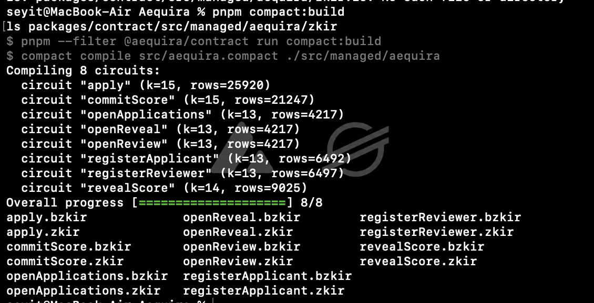
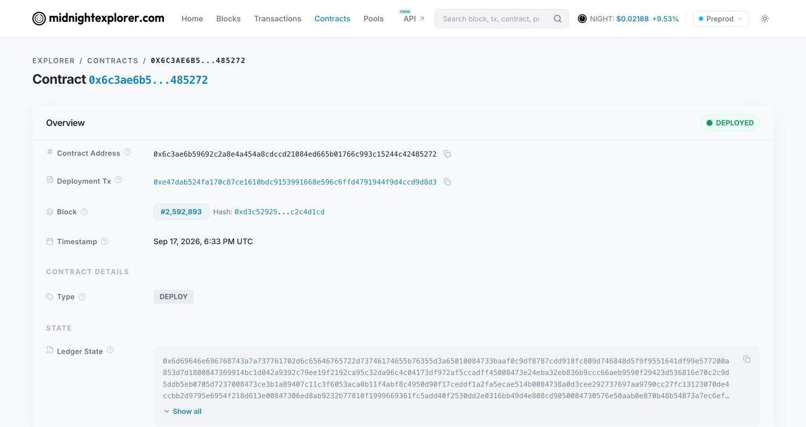
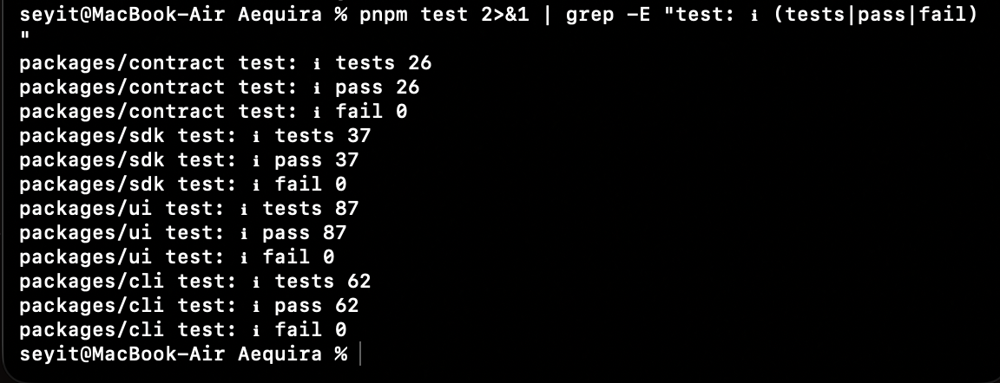
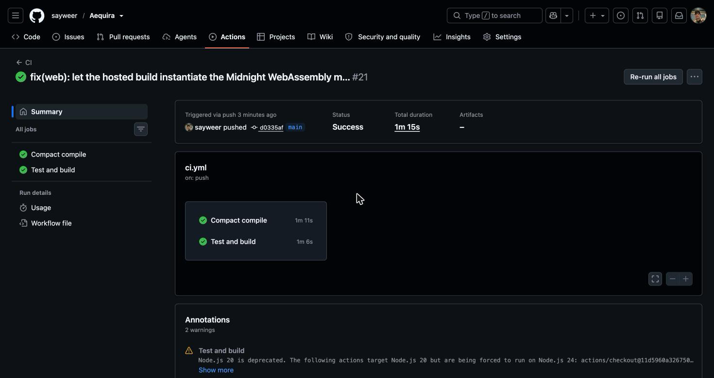
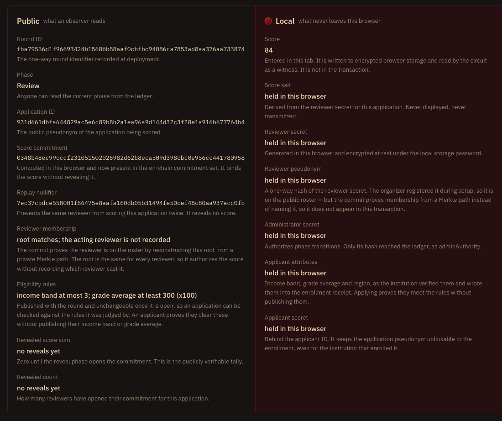

# AEQUIRA

[](https://github.com/sayweer/Aequira/actions/workflows/ci.yml)

**Sealed-ballot review on Midnight Network.** Reviewers score anonymous applications
through a commit–reveal flow: the score is proven valid while it is still hidden,
and the tally is publicly verifiable once it is opened.

|                      |                                                                                                      |
| -------------------- | ---------------------------------------------------------------------------------------------------- |
| **Live demo**        | `TODO_DEMO_URL`                                                                                      |
| **Preprod contract** | `TODO_CONTRACT_ADDRESS`                                                                              |
| **Network**          | Midnight Preprod                                                                                     |
| **Circuits**         | 6 (`registerReviewer`, `openApplications`, `openReview`, `openReveal`, `commitScore`, `revealScore`) |
| **Tests**            | 124 (`pnpm test`)                                                                                    |

---

## Initial product idea

Scholarship, micro-grant and academic award decisions carry two problems at once.
Applicants over-disclose: to prove they clear a threshold they hand over income
statements, transcripts and residence records, when the only fact the panel needs
is whether the threshold is met. Reviewers, meanwhile, know who they are judging,
and once a decision is announced nobody can verify that it followed the announced
rules. The two problems block each other's solution — anonymise the applicant and
you can no longer verify eligibility; demand documents and you destroy the
anonymity. AEQUIRA is the decision layer that resolves this: eligibility is proven
without publishing the underlying values, scores are sealed until a reveal phase so
no reviewer can be anchored or pressured by another's vote, and the final tally
stays auditable against the rubric that was published up front.

## Chosen problem: Private Voting

From the provided list, AEQUIRA implements **Private Voting — anonymous ballots with
publicly verifiable tallies**, in its review-panel form:

| Private voting concept     | AEQUIRA mechanism                                              |
| -------------------------- | -------------------------------------------------------------- |
| Sealed ballot              | `scoreCommitments`, a salted `persistentCommit` over the score |
| One vote per voter         | `scoreNullifiers`, an application-scoped one-way nullifier     |
| Voter authorization        | `reviewers`, a set of hashed reviewer pseudonyms               |
| Publicly verifiable tally  | `scoreSums` and `revealedCounts`, filled during reveal         |
| Ballot secrecy until close | the phase machine: scores open only in `REVEAL`                |

The ballot here carries a rubric score from 0 to 100 rather than a candidate choice,
which makes the tally a sum instead of a count — otherwise the shape is the same.

---

## Public state vs private witness

The contract is explicit about this split. Every `disclose()` call in
[`packages/contract/src/aequira.compact`](packages/contract/src/aequira.compact)
carries an adjacent comment stating why publishing that value is safe.

| Public ledger                                           | Private witness                              |
| ------------------------------------------------------- | -------------------------------------------- |
| `phase` — the current round phase                       | `adminSecret` — authorizes phase transitions |
| `roundId` — public round metadata                       | `reviewerSecret` — identifies the reviewer   |
| `adminAuthority` — a hash of the admin secret           | `reviewScore` — the score, until reveal      |
| `reviewers` — hashed reviewer pseudonyms                | `reviewSalt` — hides the low-entropy score   |
| `scoreCommitments` — salted score commitments           |                                              |
| `scoreNullifiers` — replay protection                   |                                              |
| `scoreSums`, `revealedCounts` — the tally, after reveal |                                              |

A witness is a value the circuit reads but the transaction never carries. The score
is the clearest case: `commitScore` reads it, proves it is within the rubric range,
and publishes only `persistentCommit(…score…, salt)`. The proof convinces the chain
that a valid score exists without the chain ever holding it.

## Privacy model

### What an observer can learn

- The round phase, the round identifier, and the number of registered reviewers.
- Which reviewer pseudonyms are authorized.
- How many sealed commitments and nullifiers exist, and therefore how many scores
  were cast for each application.
- After the reveal phase: the score sum and reviewer count per application.
- **A known limitation at this level:** `commitScore` calls
  `disclose(reviewerId)`, so an observer learns _which pseudonym scored which
  application_. Scores stay hidden, but reviewer activity is linkable. Replacing the
  hashed allowlist with a private Merkle membership proof is the next step; until
  then AEQUIRA does not claim reviewer unlinkability. This is recorded in
  [`SYNTAX.md`](SYNTAX.md) and admitted in a comment on the `disclose` call itself.

### What an observer cannot learn

- The score itself, before that reviewer chooses to reveal it.
- The score salt, the reviewer secret, or the administrator secret.
- Which wallet is behind a reviewer pseudonym.
- Any score at all if the round never reaches the reveal phase.

### Observable privacy behaviour

The app demonstrates rather than asserts this. Enter a score, commit it, and the
disclosure panel shows the commitment that is now in the on-chain set beside the
score that is not — with the verbatim public record expanded so the number can be
searched for and not found. Reveal the same score and the on-chain sum changes to
match it. The same property is pinned by a test: the serialized public view is
asserted not to contain the committed score
([`packages/ui/test/privacy-view.test.mjs`](packages/ui/test/privacy-view.test.mjs)).

A second, inverted demonstration: revealing with the wrong score is refused in the
browser before any transaction is built, because this machine can recompute the
commitment and check the opening itself.

---

## Running locally

Requirements: Node.js `24.11.1`+, pnpm `11.9.0`, Compact devtools `0.5.1`, Docker
(for the local proof server), and [Lace](https://www.lace.io/) set to Midnight
Preprod with tDUST available.

```bash
pnpm install
pnpm compact:build          # compile the contract to circuits and keys
pnpm test                   # 124 tests, no proof server needed
pnpm proof-server:up        # only if Lace does not prove for you, see below
pnpm --filter @aequira/ui dev
```

Open `http://127.0.0.1:3000` in Chrome. Then:

1. **Connect Lace.** The app enumerates every wallet injected under
   `window.midnight` and requires a Preprod address.
2. **Deploy a new round**, choosing a local-only storage password. The password
   encrypts private state in this browser and is never sent to Lace or the network.
3. **Register the reviewer pseudonym** shown in the organizer panel — it is the
   one-way hash of this browser's reviewer secret.
4. **Open applications**, then **open review**.
5. **Commit a sealed score** for an application ID (any 32-byte hex value).
6. **Open reveal**, then **reveal** the same score. The tally appears in the ledger
   panel.

> Keep the browser's site data for this origin. The administrator and reviewer
> secrets live in encrypted IndexedDB storage keyed to the Lace shielded address;
> clearing it makes the round unmanageable.

### Where proofs are generated

Proving consumes the private witness, so the destination matters. The app picks one
and shows which in the contract panel:

- **In Lace** — preferred. If the wallet implements the DApp connector's
  `getProvingProvider`, AEQUIRA hands it key material and the witness never leaves
  the extension. No local server needed, which is what makes the hosted demo work.
- **On this machine (dev proxy)** — in development, Vite forwards
  `/__aequira_local` to the loopback proof server, keeping the request same-origin.
- **On this machine** — a proof server at `127.0.0.1:6300`. Anything non-loopback or
  credential-bearing is rejected outright, including an explicitly configured
  `VITE_PROOF_SERVER_URL`.

If your Lace build does not implement wallet proving, run `pnpm proof-server:up`
before deploying or scoring.

### Deploying the web app

`vercel.json` builds from the repository root. On Vercel, set Framework Preset to
**Other**, leave Root Directory empty, and do not set `VITE_PROOF_SERVER_URL`. The
first proof is slow: `commitScore.prover` alone is 9.5 MB and is fetched from the
deployed origin.

Verify the hosted build locally first:

```bash
pnpm run build:web
```

---

## Architecture

```
packages/contract   Compact contract, and its generated circuits and keys
packages/sdk        typed deploy/join boundary, ledger reads, public value derivation
packages/cli        organizer CLI with an encrypted local wallet
packages/ui         React + Vite browser app
```

Two conventions are worth knowing before reading the UI:

**Testable logic lives outside React.** `round-inputs`, `round-format`,
`round-salt`, `privacy-view`, `session-storage` and `proof-mode` are pure modules
with `node:test` coverage; components stay dumb.
`packages/ui/tsconfig.test-build.json` lists exactly what the test build compiles.

**The score salt is derived, not random.** `AequiraPrivateState` holds one
`scoreSalt`, and `revealScore` must reproduce the exact `(score, salt)` pair behind
the on-chain commitment — so a fresh random salt per commit silently destroys the
opening of every application a reviewer already scored. The browser derives it as
`SHA-256("aequira:ui-salt:v1" || roundId || applicationId || reviewerSecret)`
instead. It stays secret because it is seeded with 256 bits of reviewer secret,
which matters: a score carries roughly seven bits of entropy and an unsalted
commitment would be trivially brute-forced. See
[`packages/ui/src/round-salt.ts`](packages/ui/src/round-salt.ts).

Static analysis is TypeScript in strict mode with `exactOptionalPropertyTypes` and
`noUncheckedIndexedAccess`; there is no separate linter.

---

## Organizer CLI

The CLI runs the same round from a terminal, using a project-only wallet whose seed
is encrypted at rest with AES-256-GCM in an ignored, owner-only vault. It exists for
organizers who should not depend on a browser extension, and follows Midnight's
[Preprod DUST guide](https://docs.midnight.network/guides/generating-dust-programmatically).

```bash
pnpm --filter @aequira/cli start wallet-create   --network preprod
pnpm --filter @aequira/cli start wallet-address  --network preprod   # fund this at the faucet
pnpm --filter @aequira/cli start funding-status  --network preprod
pnpm --filter @aequira/cli start register-dust   --network preprod
pnpm --filter @aequira/cli doctor

pnpm --filter @aequira/cli start deploy --network preprod --round-id ROUND_ID_64_HEX
pnpm --filter @aequira/cli start join   --network preprod --contract-address ADDRESS
pnpm --filter @aequira/cli start register-reviewer  --network preprod --contract-address ADDRESS --reviewer-id ID_64_HEX
pnpm --filter @aequira/cli start open-applications --network preprod --contract-address ADDRESS
pnpm --filter @aequira/cli start open-review       --network preprod --contract-address ADDRESS
pnpm --filter @aequira/cli start commit-score      --network preprod --contract-address ADDRESS --application-id ID_64_HEX
pnpm --filter @aequira/cli start open-reveal       --network preprod --contract-address ADDRESS
pnpm --filter @aequira/cli start reveal-score      --network preprod --contract-address ADDRESS --application-id ID_64_HEX
```

Secrets are only ever read through masked interactive prompts; the argument parser
rejects `--seed`, `--password`, `--score` and similar outright. `commit-score`
prompts for the score and generates its salt internally. Deploy and state-changing
calls stop before building a transaction when the synchronized Dust balance is zero.
Successful calls write an encrypted, password-authenticated backup that `restore`
can read back into an empty store without overwriting anything.

---

## Screenshots

|                                 |                                                     |
| ------------------------------- | --------------------------------------------------- |
| Compile output, circuits listed |      |
| Contract deployed with address  |  |
| Test suite passing              |         |
| CI passing                      |               |
| Commitment public, score local  |       |

## Verification

```bash
pnpm compact:check   # format check, then compile 6 circuits
pnpm format:check
pnpm build
pnpm typecheck
pnpm test
```

CI runs the Compact compile and this suite on every push, as two independent jobs.

## Level checklist

| Requirement                                | Where                                                                            |
| ------------------------------------------ | -------------------------------------------------------------------------------- |
| Contract compiles via `compact compile`    | `pnpm compact:build`; CI `compact` job                                           |
| Generated `managed/` present               | [`packages/contract/src/managed/`](packages/contract/src/managed) — 24 ZK assets |
| Passing test suite                         | 124 tests, `pnpm test`; CI `verify` job                                          |
| Deployed to Preprod with a visible address | table at the top of this file                                                    |
| Public state vs private witness explained  | [Public state vs private witness](#public-state-vs-private-witness)              |
| Initial product idea                       | [Initial product idea](#initial-product-idea)                                    |
| Lace connect / disconnect                  | `packages/ui/src/hooks/useWalletConnection.ts`                                   |
| Circuit called from the frontend           | `packages/ui/src/round.ts`; all six circuits                                     |
| Observable privacy behaviour               | [Observable privacy behaviour](#observable-privacy-behaviour)                    |
| Live demo link                             | table at the top of this file                                                    |
| Minimum 3 tests passing                    | 124                                                                              |
| CI/CD pipeline                             | [`.github/workflows/ci.yml`](.github/workflows/ci.yml) + badge above             |
| Approved idea from the provided list       | [Chosen problem: Private Voting](#chosen-problem-private-voting)                 |
| Privacy model section                      | [Privacy model](#privacy-model)                                                  |
